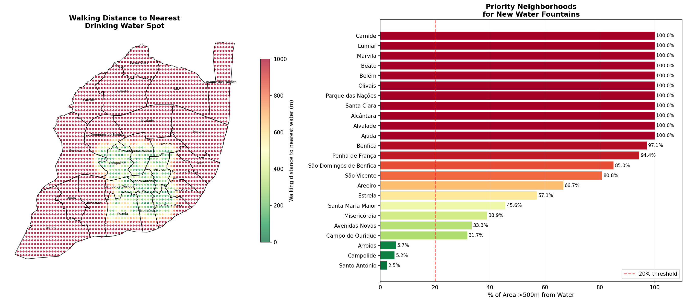

# 💧 Lisbon Drinking Water Accessibility Analysis

Geospatial analysis identifying underserved neighborhoods in Lisbon 
and recommending optimal locations for new public drinking water fountains.

## 🚨 Key Findings
- **159 water spots** mapped across Lisbon
- **11 neighborhoods** have 0% water coverage (100% of residents walk >500m)
- **Parque das Nações** has the worst access — avg walk of **7,970m**
- **Santo António & Campolide** are best served (<5% underserved)

## 📍 Top Priority Neighborhoods for New Fountains
| Neighborhood | Avg Walk (m) | % Underserved |
|---|---|---|
| Parque das Nações | 7,971 | 100% |
| Belém | 6,540 | 100% |
| Santa Clara | 6,908 | 100% |
| Olivais | 5,401 | 100% |
| Lumiar | 4,563 | 100% |

## 📊 Visualizations

## 🛠️ Methodology
- Water spots: OpenStreetMap via Overpass Turbo
- Boundaries: Câmara Municipal de Lisboa open data
- Walking distance: KD-Tree nearest neighbor × 1.35 walking factor
- Grid resolution: 200m spacing (~residential simulation)

## 📁 Files
| File | Description |
|---|---|
| `accessibility_priority.csv` | % underserved + avg walk per neighborhood |
| `fountain_recommendations.csv` | GPS coords for recommended new fountains |
| `neighborhood_coverage.csv` | Raw spot counts per neighborhood |
| `density_analysis.csv` | Spots per km² per neighborhood |

## 🔧 Tools
Python
