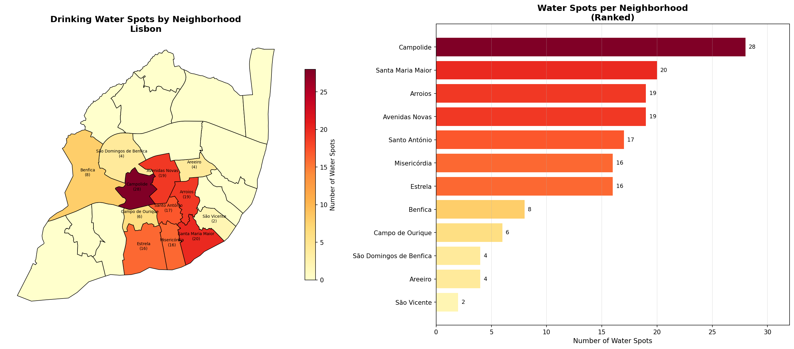
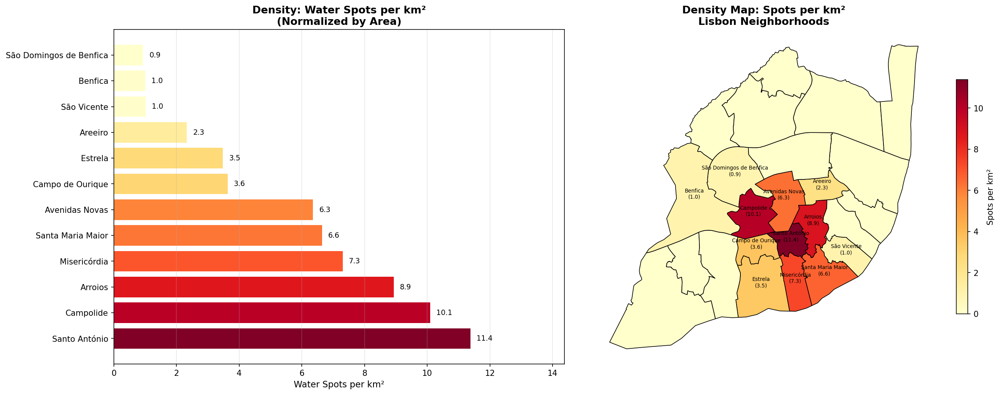

# 💧 Lisbon Drinking Water Analysis

Geospatial analysis of public drinking water spots across Lisbon neighborhoods.

## Results

## Data Sources
- Water spots: OpenStreetMap via Overpass Turbo
- Boundaries: Câmara Municipal de Lisboa (geodados-cml.hub.arcgis.com)

## Key Findings
- 159 water spots mapped across 12 of 24 neighborhoods
- Campolide has the most spots (28); Misericórdia leads in density
